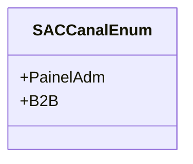

# SACCanalEnum
**Namespace**: IsthmusWinthor.Dominio.Enumeradores  
**Nome do Arquivo**: SACCanalEnum.cs  

O `SACCanalEnum` é um enumerador que define os canais de atendimento disponíveis no sistema de SAC (Serviço de Atendimento ao Consumidor). Sua utilização é essencial para garantir que os canais de atendimento sejam padronizados e facilmente reconhecíveis dentro do domínio do sistema.

## Tipos Auxiliares e Dependências
- **Enums**:
  - [SACCanalEnum](SACCanalEnum.md)

## Diagrama de Relacionamentos

---
Gerada em 29/12/2025 20:59:46
