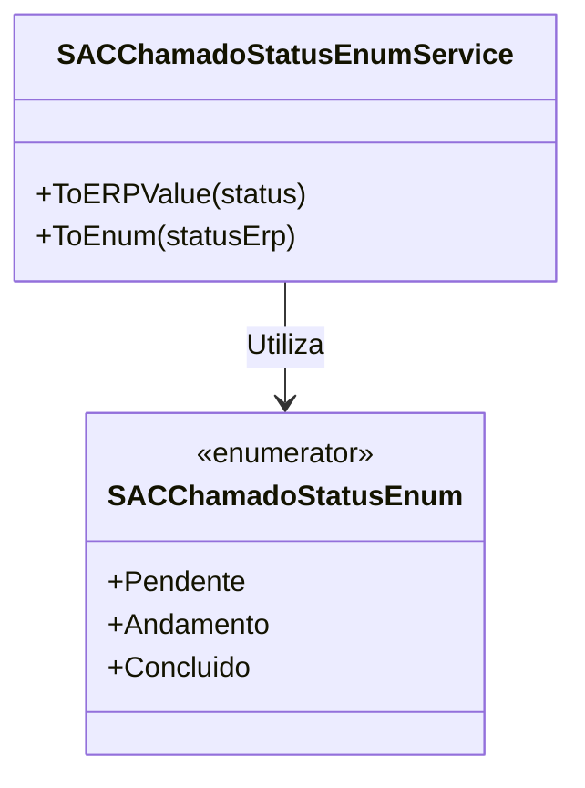

# SACChamadoStatusEnum

**Namespace**: IsthmusWinthor.Dominio.Enumeradores  
**Nome do Arquivo**: SACChamadoStatusEnum.cs

## Visão Geral e Responsabilidade
A classe `SACChamadoStatusEnum` representa os diferentes status possíveis que um chamado pode ter no sistema de atendimento ao cliente (SAC). Este enum é fundamental para a lógica de controle e monitoramento do fluxo de chamados, permitindo a categorização adequada de cada chamado em relação ao seu estado atual, como "Pendente", "Em Andamento" ou "Concluído".

## Métodos de Negócio

### Título: ToERPValue (public static)
- **Objetivo**: Converter um status do chamado em seu equivalente no sistema ERP. Esta conversão assegura que a comunicação entre sistemas diferentes seja precisa e que o status do chamado seja interpretado corretamente.
- **Comportamento**:
  1. Recebe um valor do tipo `SACChamadoStatusEnum`.
  2. Verifica o status recebido:
     - Se for `Andamento`, retorna "EA".
     - Se for `Concluido`, retorna "CO".
     - Nos demais casos, retorna "PE".
- **Retorno**: Uma `string` que representa o valor do status conforme esperado pelo ERP.

### Título: ToEnum (public static)
- **Objetivo**: Converter um valor de status em formato ERP para o respectivo enum `SACChamadoStatusEnum`. Esta função garante que os status recebidos por meio de integrações com o ERP sejam corretamente mapeados para o domínio da aplicação.
- **Comportamento**:
  1. Recebe uma `string` representando o status informado pelo ERP.
  2. Avalia o valor do status:
     - Se for "EA", "AB", "SO", "RE", "RT", "PR", ou "CP", retorna `Andamento`.
     - Se for "CO", retorna `Concluido`.
     - Se for "PE" ou "RB" (ou qualquer outro valor), retorna `Pendente`.
- **Retorno**: Um valor do tipo `SACChamadoStatusEnum` que representa o status convertido.

## Propriedades Calculadas e de Validação
Não existem propriedades calculadas ou com validações nesta classe, pois ela é composta apenas por enums e métodos auxiliares.

## Navigation Property
Não existem Navigation Properties associadas a esta classe, uma vez que não representa uma estrutura com classes complexas.

## Tipos Auxiliares e Dependências
- Enum: `[SACChamadoStatusEnum](SACChamadoStatusEnum.md)`
- Classe Estática: `[SACChamadoStatusEnumService](SACChamadoStatusEnumService.md)`

## Diagrama de Relacionamentos

Esta documentação técnica fornece uma visão clara e estruturada sobre a `SACChamadoStatusEnum` e sua funcionalidade crucial no gerenciamento de status de chamados no sistema de atendimento ao cliente.
