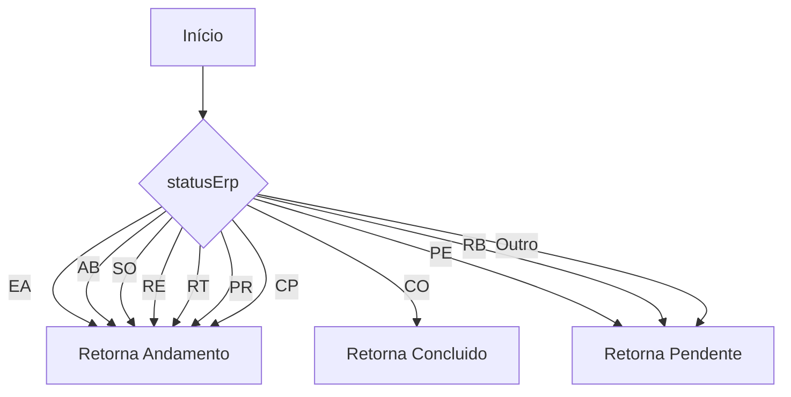
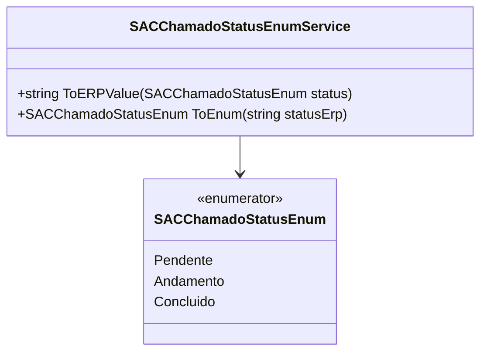

# SACChamadoStatusEnumService

**Namespace**: IsthmusWinthor.Dominio.Enumeradores  
**Nome do Arquivo**: SACChamadoStatusEnumService.cs

## Visão Geral e Responsabilidade
A classe `SACChamadoStatusEnumService` atua como um serviço auxiliar que fornece funcionalidades para converter entre os estados do chamado no sistema e os valores reconhecidos pelo ERP. Ela resolve o problema de inconsistência de terminologias e estados utilizados ao integrar o sistema de gestão de chamados com o ERP, garantindo que os chamados sejam corretamente representados nas duas plataformas.

## Métodos de Negócio

### ToERPValue (public static)
- **Objetivo**: Este método garante que o status do chamado seja corretamente convertido para um formato reconhecido pelo ERP.
- **Comportamento**:
  1. Recebe um valor do enumerador `SACChamadoStatusEnum`.
  2. Verifica o status do chamado:
     - Se for `Andamento`: retorna "EA".
     - Se for `Concluido`: retorna "CO".
     - Para qualquer outro status (incluindo `Pendente`): retorna "PE".
- **Retorno**: Retorna uma string representando o valor correspondente do status para o ERP.

```mermaid
flowchart TD
    A[Início] --> B{Status}
    B -->|Andamento| C[Retorna "EA"]
    B -->|Concluido| D[Retorna "CO"]
    B -->|Pendente| E[Retorna "PE"]
    B -->|Outro| E
```

### ToEnum (public static)
- **Objetivo**: Este método assegura que os status do chamado expressos como strings no ERP sejam convertidos para o formato do enumerador.
- **Comportamento**:
  1. Recebe uma string que representa o status conforme utilizado pelo ERP.
  2. Verifica o valor recebido:
     - Para valores correspondentes a "EA", "AB", "SO", "RE", "RT", "PR" e "CP": retorna `SACChamadoStatusEnum.Andamento`.
     - Para "CO": retorna `SACChamadoStatusEnum.Concluido`.
     - Para "PE", "RB" ou qualquer outro valor (default): retorna `SACChamadoStatusEnum.Pendente`.
- **Retorno**: Retorna um valor de `SACChamadoStatusEnum` que representa o estado convertido.



## Propriedades Calculadas e de Validação
Não há propriedades calculadas ou de validação nesta classe, uma vez que todas as operações são geridas por métodos estáticos.

## Navigations Property
Não existem propriedades do tipo classe complexa dentro desta classe.

## Tipos Auxiliares e Dependências
- **Enumeradores**: 
  - [`SACChamadoStatusEnum`](SACChamadoStatusEnum.md)

## Diagrama de Relacionamentos

---
Gerada em 29/12/2025 21:00:05
