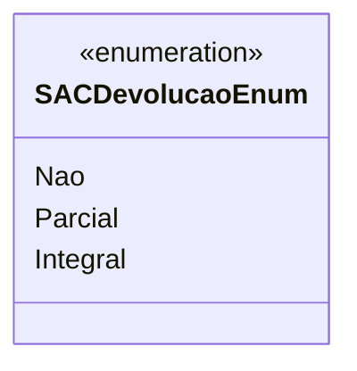

# SACDevolucaoEnum
**Namespace**: IsthmusWinthor.Dominio.Enumeradores  
**Nome do Arquivo**: SACDevolucaoEnum.cs  

O `SACDevolucaoEnum` é um enumerador que tipifica as diferentes condições de devolução dentro do contexto do sistema SAC (Serviço de Atendimento ao Cliente). Ele garante que as devoluções sejam categorizadas de forma consistente, evitando erros e mal-entendidos nas operações relacionadas a devoluções.

## Tipos Auxiliares e Dependências
- Nenhuma classe ou função auxiliar utilizada.

## Diagrama de Relacionamentos

Este diagrama representa o `SACDevolucaoEnum`, evidenciando suas opções de devolução possíveis. Como um enumerador, ele não possui dependências com propriedades de navegação ou outros tipos complexos.
---
Gerada em 29/12/2025 21:00:10
