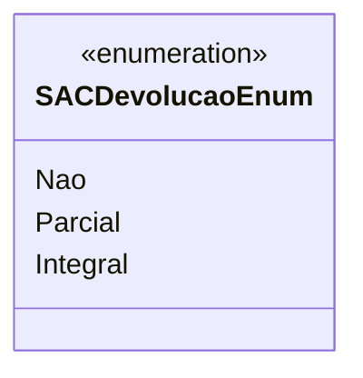

# SACDevolucaoEnum
**Namespace**: IsthmusWinthor.Dominio.Enumeradores  
**Nome do Arquivo**: SACDevolucaoEnum.cs  

O `SACDevolucaoEnum` é um enumerador que categoriza os diferentes tipos de devoluções possíveis dentro do sistema de atendimento ao cliente (SAC). Sua finalidade é facilitar a distinção entre devoluções e auxiliar na implementação de regras de negócio específicas, garantindo clareza na manipulação de dados relacionados.

## Tipos Auxiliares e Dependências
- **Enumeradores**:
  - `[SACDevolucaoEnum](SACDevolucaoEnum.md)`: Enumeração que define os tipos de devolução.

## Diagrama de Relacionamentos

