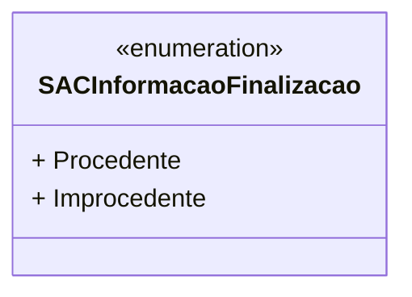

# SACInformacaoFinalizacao
**Namespace**: IsthmusWinthor.Dominio.Enumeradores  
**Nome do Arquivo**: SACInformacaoFinalizacao.cs  

Este enum representa as possíveis classificações de uma informação finalizada em um Sistema de Atendimento ao Cliente, permitindo a identificação se uma reclamação ou solicitação é considerada procedente ou improcedente.

## Tipos Auxiliares e Dependências
- Enumeradores:
  - `[SACInformacaoFinalizacao](SACInformacaoFinalizacao.md)` 

## Diagrama de Relacionamentos

