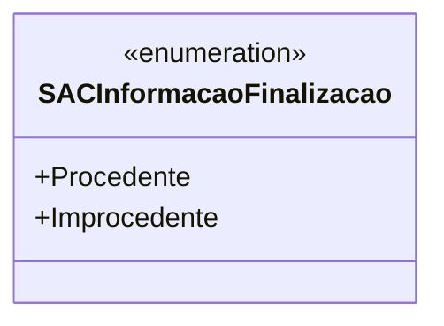

# SACInformacaoFinalizacao
**Namespace**: IsthmusWinthor.Dominio.Enumeradores  
**Nome do Arquivo**: SACInformacaoFinalizacao.cs  

Enumeração que representa as informações de finalização de um Serviço de Atendimento ao Cliente (SAC).

---

### Tipos Auxiliares e Dependências
- Enumeradores:
  - [SACInformacaoFinalizacao](SACInformacaoFinalizacao.md)

---

### Diagrama de Relacionamentos

---
Gerada em 29/12/2025 21:00:13
