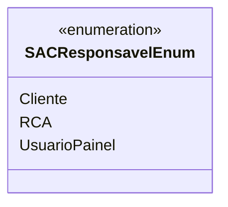

# SACResponsavelEnum
**Namespace**: IsthmusWinthor.Dominio.Enumeradores  
**Nome do Arquivo**: SACResponsavelEnum.cs  

Este enumerador lista os responsáveis possíveis para o Sistema de Atendimento ao Cliente (SAC). Ele é utilizado para identificar o agente que está gerenciando determinadas interações no contexto do atendimento ao cliente, contribuindo para a organização e a clareza nas atribuições de tarefas.

## Tipos Auxiliares e Dependências
- **Enumeradores**:
  - `[SACResponsavelEnum](SACResponsavelEnum.md)`: Enum que categoriza os responsáveis no atendimento.

