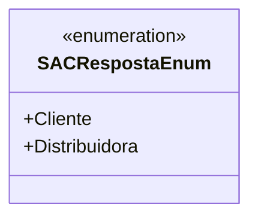

# SACRespostaEnum
**Namespace**: IsthmusWinthor.Dominio.Enumeradores  
**Nome do Arquivo**: SACRespostaEnum.cs  

Esta é uma classe enumeradora que define as possíveis categorias de respostas em um sistema de SAC (Serviço de Atendimento ao Cliente). Seu objetivo é proporcionar um transporte de dados categorizando as respostas em duas opções: 'Cliente' e 'Distribuidora'. 

### Tipos Auxiliares e Dependências
- **Enumeradores**:
  - [SACRespostaEnum](SACRespostaEnum.md)

### Diagrama de Relacionamentos

---
Gerada em 29/12/2025 21:00:24
