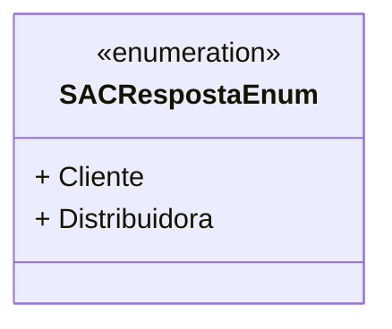

# SACRespostaEnum
**Namespace**: IsthmusWinthor.Dominio.Enumeradores  
**Nome do Arquivo**: SACRespostaEnum.cs  

O `SACRespostaEnum` é uma enumeração que define as diferentes respostas possíveis para interações com o Serviço de Atendimento ao Cliente (SAC), categorizando-as entre "Cliente" e "Distribuidora". Isso permite uma gestão clara e tipada das respostas no sistema, refletindo a origem da solicitação de suporte.

## Tipos Auxiliares e Dependências
- Enumeradores:
  - `[SACRespostaEnum](SACRespostaEnum.md)`

## Diagrama de Relacionamentos

