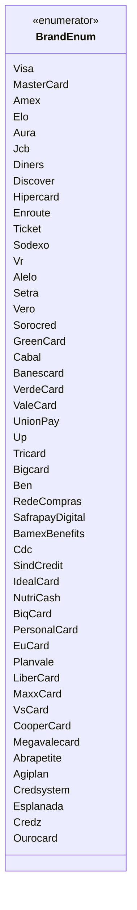

# BrandEnum
**Namespace**: IsthmusWinthor.Dominio.Enumeradores.SafraPay  
**Nome do Arquivo**: BrandEnum.cs  

Este enumerador é utilizado para representar as diversas bandeiras de cartões disponíveis no sistema, garantindo a correta identificação e categorização de diferentes marcas que podem ser utilizadas em transações financeiras.

## Tipos Auxiliares e Dependências
- Este enumerador não possui dependências ou classes estáticas adicionais, mas é uma parte fundamental da lógica de validação e categorização de cartões no sistema.

## Diagrama de Relacionamentos

---
Gerada em 29/12/2025 21:08:32
