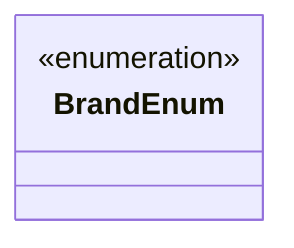

# BrandEnum
**Namespace**: IsthmusWinthor.Dominio.Enumeradores.SafraPay  
**Nome do Arquivo**: BrandEnum.cs  

O `BrandEnum` é um enumerador que representa as marcas aceitas de cartões de pagamento dentro do sistema SafraPay. Sua finalidade é padronizar e facilitar a manipulação dos diferentes tipos de cartões pelos quais as transações podem ser realizadas.

## Tipos Auxiliares e Dependências
- Nenhum tipo auxiliar ou dependência adicional foi identificado.

## Diagrama de Relacionamentos

Neste diagrama, o `BrandEnum` é representado como uma classe de enumeração, indicando que ele possui um conjunto fixo de constantes que referenciam as diferentes marcas de cartões disponíveis.
