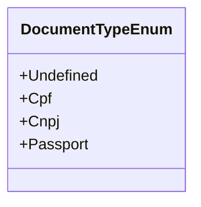

# DocumentTypeEnum
**Namespace**: IsthmusWinthor.Dominio.Enumeradores.SafraPay  
**Nome do Arquivo**: DocumentTypeEnum.cs  

O `DocumentTypeEnum` é um enumerador utilizado para definir os tipos de documentos reconhecidos pelo sistema. Ele tem como finalidade facilitar a identificação e validação de documentos pessoais durante processos de cadastro e autenticação de usuários.

## Tipos Auxiliares e Dependências
- **Enumeradores**:
  - [DocumentTypeEnum](DocumentTypeEnum.md)

## Diagrama de Relacionamentos

---
Gerada em 29/12/2025 21:08:35
