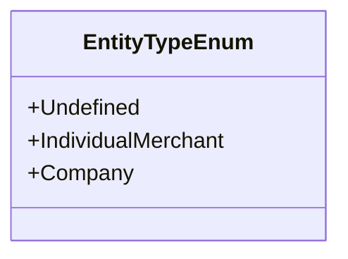

# EntityTypeEnum
**Namespace**: IsthmusWinthor.Dominio.Enumeradores.SafraPay  
**Nome do Arquivo**: EntityTypeEnum.cs  

### Visão Geral e Responsabilidade
O `EntityTypeEnum` é uma enumeração que define os tipos de entidades que podem ser utilizadas dentro do sistema SafraPay. Ele categoriza os comercios em termos de sua natureza jurídica, facilitando a classificação e o tratamento adequado de comerciantes individuais e empresas. Essa estrutura é fundamental para assegurar a integridade de dados na aplicação, uma vez que diferentes tipos de entidades podem ter requisitos operacionais e regulamentações distintas.

### Tipos Auxiliares e Dependências
- Não existem tipos auxiliares adicionais ou classes que utilizem esta enumeração.

### Diagrama de Relacionamentos

---
Gerada em 29/12/2025 21:08:40
