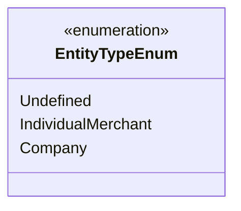

# EntityTypeEnum
**Namespace**: IsthmusWinthor.Dominio.Enumeradores.SafraPay  
**Nome do Arquivo**: EntityTypeEnum.cs  

A classe `EntityTypeEnum` define os tipos de entidades que podem ser representados dentro do sistema. Este enumerador é utilizado para classificar se uma entidade é um comerciante individual, uma empresa ou indefinido, permitindo assim, a correta categorização e tratamento dos dados de acordo com o tipo de entidade.

## Tipos Auxiliares e Dependências
- **Enumeradores**: 
  - `[EntityTypeEnum](EntityTypeEnum.md)` 

## Diagrama de Relacionamentos

