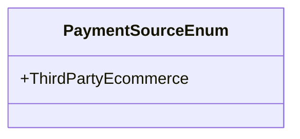

# PaymentSourceEnum
**Namespace**: IsthmusWinthor.Dominio.Enumeradores.SafraPay  
**Nome do Arquivo**: PaymentSourceEnum.cs  

O `PaymentSourceEnum` é um enumerador que define as diferentes fontes de pagamento disponíveis no sistema, atuando como um tipo seguro para referenciar as opções de pagamento.

## Tipos Auxiliares e Dependências
- Enum: `[PaymentSourceEnum](PaymentSourceEnum.md)`

## Diagrama de Relacionamentos

