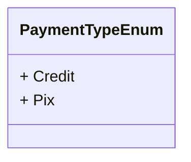

# PaymentTypeEnum
**Namespace**: IsthmusWinthor.Dominio.Enumeradores.SafraPay  
**Nome do Arquivo**: PaymentTypeEnum.cs  

Esta enumeração define os tipos de pagamento disponíveis no sistema, especificamente para integrações relacionadas ao SafraPay.

## Tipos Auxiliares e Dependências
- **Enumeradores**:
  - `[PaymentTypeEnum](PaymentTypeEnum.md)`

## Diagrama de Relacionamentos

