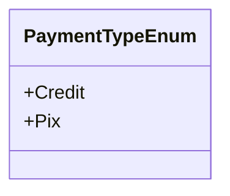

# PaymentTypeEnum
**Namespace**: IsthmusWinthor.Dominio.Enumeradores.SafraPay  
**Nome do Arquivo**: PaymentTypeEnum.cs  

Este enumerador é utilizado para identificar os tipos de métodos de pagamento disponíveis na aplicação, essencial para garantir a integridade nas transações financeiras. 

## Tipos Auxiliares e Dependências
- Enumeradores:
  - [PaymentTypeEnum](PaymentTypeEnum.md)

## Diagrama de Relacionamentos

---
Gerada em 29/12/2025 21:08:46
