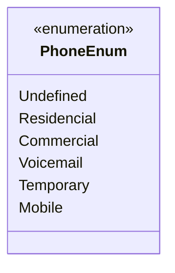

# PhoneEnum
**Namespace**: IsthmusWinthor.Dominio.Enumeradores.SafraPay  
**Nome do Arquivo**: PhoneEnum.cs  

O `PhoneEnum` é um enumerador que classifica diferentes tipos de número de telefone. Sua finalidade é assegurar a padronização e validação dos tipos de telefone utilizados no sistema, garantindo que apenas valores predefinidos sejam considerados válidos em processos que envolvem o uso de números de telefone no domínio da aplicação. 

### Tipos Auxiliares e Dependências
- `PhoneEnum`: Enumeração que define os tipos de telefone utilizados no sistema.

---

---
Gerada em 29/12/2025 21:08:50
