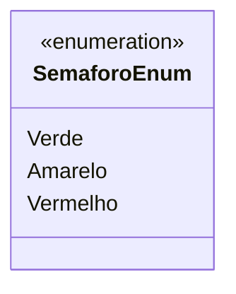

# SemaforoEnum
**Namespace**: IsthmusWinthor.Dominio.Enumeradores  
**Nome do Arquivo**: SemaforoEnum.cs  

`SemaforoEnum` é uma enumeração que representa os estados de um semáforo, utilizados para sinalização e controle de fluxo de tráfego.

## Tipos Auxiliares e Dependências
- Classe auxiliar que define os estados disponíveis para o semáforo:
  - `Verde`: Indica que o tráfego pode seguir.
  - `Amarelo`: Indica precaução e que o tráfego deve reduzir a velocidade.
  - `Vermelho`: Indica que o tráfego deve parar.

Esses estados são utilizados em sistemas que controlam ou gerenciam o fluxo de veículos e pedestres, assegurando a segurança nas vias.

## Diagrama de Relacionamentos

---
Gerada em 29/12/2025 21:00:31
