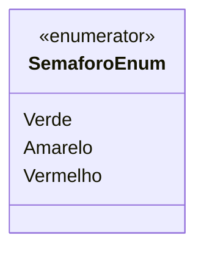

# SemaforoEnum
**Namespace**: IsthmusWinthor.Dominio.Enumeradores  
**Nome do Arquivo**: SemaforoEnum.cs

Esta classe define um enumerador que representa os estados de um semáforo no contexto de sistema, que pode ser utilizado para indicar a situação atual do tráfego ou de algum processo.

## Tipos Auxiliares e Dependências
- **Enumeradores**:
  - `[SemaforoEnum](SemaforoEnum.md)`: Representa os estados de um semáforo: Verde, Amarelo e Vermelho. 

## Diagrama de Relacionamentos

Este diagrama ilustra a definição do enumerador `SemaforoEnum`, que categoriza os estados que o semáforo pode assumir.
