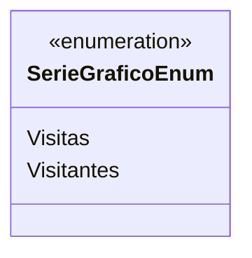

# SerieGraficoEnum
**Namespace**: IsthmusWinthor.Dominio.Enumeradores  
**Nome do Arquivo**: SerieGraficoEnum.cs  

> Este enumerador define os tipos de séries gráficos utilizados em relatórios de métricas de visitas e visitantes em uma aplicação.

## Tipos Auxiliares e Dependências
- **Enums:**
  - [SerieGraficoEnum](SerieGraficoEnum.md) - Define as categorias de séries para gráficos de métricas. 

## Diagrama de Relacionamentos

---
Gerada em 29/12/2025 21:00:35
