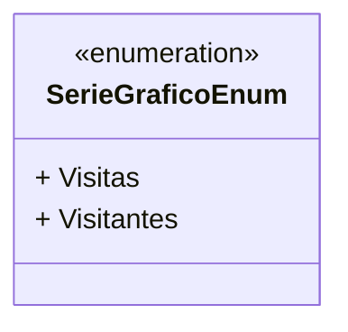

# SerieGraficoEnum
**Namespace**: IsthmusWinthor.Dominio.Enumeradores  
**Nome do Arquivo**: SerieGraficoEnum.cs  

A classe `SerieGraficoEnum` é um tipo enumerador que se destina a representar diferentes tipos de séries de gráficos utilizados na visualização de dados de visitantes em um sistema. Essa enumeração é essencial para garantir que apenas séries de gráficos válidas e conhecidas sejam utilizadas nas operações do sistema, promovendo a integridade e clareza nas análises de dados.

### Tipos Auxiliares e Dependências
- Nenhum Enumerador ou Classe Estática/Helper adicional é utilizado por esta enumeração diretamente, mas pode ser referenciado em outras partes do sistema para visualizar as métricas de visitantes e visitas.

### Diagrama de Relacionamentos

Este diagrama representa a enumeração `SerieGraficoEnum`, que define as constantes `Visitas` e `Visitantes`, garantindo que as representações visuais no sistema se baseiem em categorias sólidas e predefinidas para a análise de dados.
