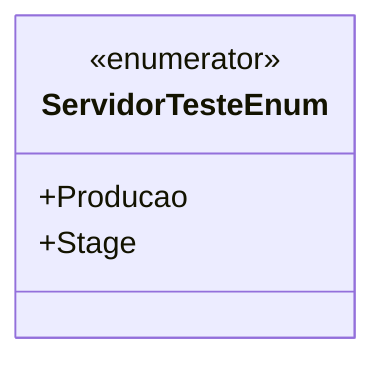

# ServidorTesteEnum
- **Namespace**: IsthmusWinthor.Dominio.Enumeradores
- **Nome do Arquivo**: ServidorTesteEnum.cs

ServidorTesteEnum é um enumerador que define as diferentes configurações de ambiente para os servidores, como Produção e Stage. Ele é utilizado para identificar em qual estágio o sistema está operando, permitindo que as regras de negócio sejam aplicadas de forma adequada dependendo do ambiente.

## Tipos Auxiliares e Dependências
- **Enumeradores**:
  - [ServidorTesteEnum](ServidorTesteEnum.md)

## Diagrama de Relacionamentos

---
Gerada em 29/12/2025 21:00:39
