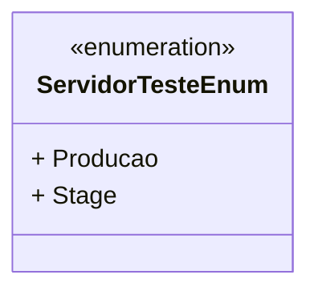

# ServidorTesteEnum
- **Namespace**: IsthmusWinthor.Dominio.Enumeradores
- **Nome do Arquivo**: ServidorTesteEnum.cs

O `ServidorTesteEnum` é uma enumeração que define os ambientes em que um servidor pode operar, ajudando a padronizar a identificação desses ambientes em todo o sistema.

## Tipos Auxiliares e Dependências
- Enumeradores:
  - `[ServidorTesteEnum](ServidorTesteEnum.md)`

## Diagrama de Relacionamentos

