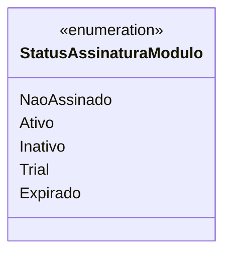

# StatusAssinaturaModulo

**Namespace**: IsthmusWinthor.Dominio.Enumeradores  
**Nome do Arquivo**: StatusAssinaturaModulo.cs  

## Visão Geral e Responsabilidade
`StatusAssinaturaModulo` é um enumerador que define os estados possíveis de uma assinatura de módulo dentro do sistema. Ele permite a categorização e controle do status de uma assinatura, refletindo seus diferentes estágios, desde não assinado até expirado. Esse enum é fundamental para a lógica de negócios relacionada à ativação e gerenciamento de funcionalidades disponíveis aos usuários com base no status da assinatura.

## Tipos Auxiliares e Dependências
- Nenhum.

## Diagrama de Relacionamentos

