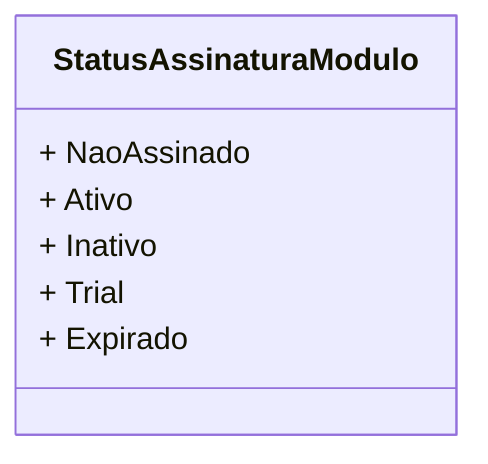

# StatusAssinaturaModulo
**Namespace**: IsthmusWinthor.Dominio.Enumeradores  
**Nome do Arquivo**: StatusAssinaturaModulo.cs  

Essa classe é um enumerador que representa os diferentes estados possíveis de uma assinatura de módulo, definindo claramente as possibilidades de status para uma gestão eficiente das assinaturas.

## Tipos Auxiliares e Dependências
- **Enumeradores**:
  - [StatusAssinaturaModulo](StatusAssinaturaModulo.md)

## Diagrama de Relacionamentos

---
Gerada em 29/12/2025 21:00:43
