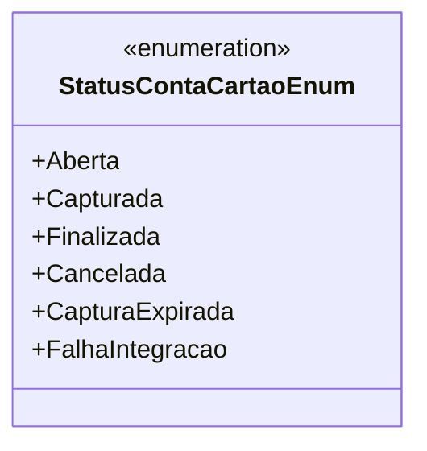

# StatusContaCartaoEnum
**Namespace**: IsthmusWinthor.Dominio.Enumeradores  
**Nome do Arquivo**: StatusContaCartaoEnum.cs  

Este enumerador é utilizado para representar os diferentes estados de uma conta vinculada a um cartão, facilitando a identificação e o gerenciamento do fluxo de processamento do pagamento.

## Tipos Auxiliares e Dependências
- **Enumeradores:**
  - [StatusContaCartaoEnum](StatusContaCartaoEnum.md)

## Diagrama de Relacionamentos

---
Gerada em 29/12/2025 21:00:47
