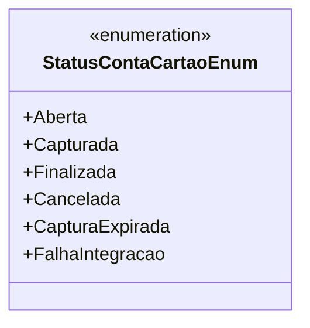

# StatusContaCartaoEnum
**Namespace**: IsthmusWinthor.Dominio.Enumeradores  
**Nome do Arquivo**: StatusContaCartaoEnum.cs  

### Visão Geral e Responsabilidade
O `StatusContaCartaoEnum` é um enumerador que define os diferentes estados que uma conta de cartão pode assumir ao longo do seu ciclo de vida. Este enumerador é fundamental para garantir que a aplicação tratá as contas de cartão corretamente em relação a suas operações e estados, permitindo controle e rastreamento adequados ao longo de processos de pagamento e integração.

### Tipos Auxiliares e Dependências
- Nenhum tipo auxiliar ou dependência complexa.

### Diagrama de Relacionamentos

### Propriedades Calculadas e de Validação
- Nenhuma propriedade com lógica de cálculo ou validação. 

### Navigations Property
- Nenhuma propriedade de navegação.
