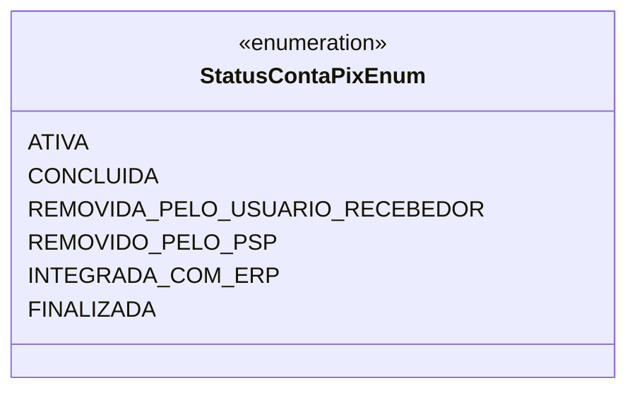

# StatusContaPixEnum

**Namespace**: IsthmusWinthor.Dominio.Enumeradores  
**Nome do Arquivo**: StatusContaPixEnum.cs  

## Visão Geral e Responsabilidade
A classe `StatusContaPixEnum` define os diferentes status que uma conta Pix pode assumir durante seu ciclo de vida dentro do sistema. Ela é crucial para a representação do estado das transações, permitindo que a aplicação rastreie e gerencie o fluxo financeiro com precisão. Cada status reflete uma fase distinta, desde a criação da conta até sua finalização, garantindo assim a clareza do processo e a eficácia nas operações de cobrança e conciliação.

## Métodos de Negócio
- **Título**: Não aplicável (Enum não contém métodos de negócio).  
   - **Objetivo**: Esse enum não contém métodos de negócio, mas cada valor representa um status de conta, refletindo as condições de cobrança e pagamento.
   - **Comportamento**: Os valores do enum são utilizados nos fluxos de negócios para determinar ações a serem tomadas com base no estado atual da conta.
   - **Retorno**: Não aplicável.

## Propriedades Calculadas e de Validação
Não há propriedades calculadas ou de validação nesta classe, pois se trata de um enum.

## Navigations Property
Não aplicável, já que esta classe não contém propriedades de navegação para classes complexas.

## Tipos Auxiliares e Dependências
Os seguintes tipos auxiliares são utilizados:
- Nenhum tipo auxiliar, enum ou classe estática adicional é referenciado diretamente.

## Diagrama de Relacionamentos

Este diagrama representa o enumerador `StatusContaPixEnum` com suas instâncias, ilustrando a estrutura e os diferentes estados que podem ser representados.
---
Gerada em 29/12/2025 21:00:57
