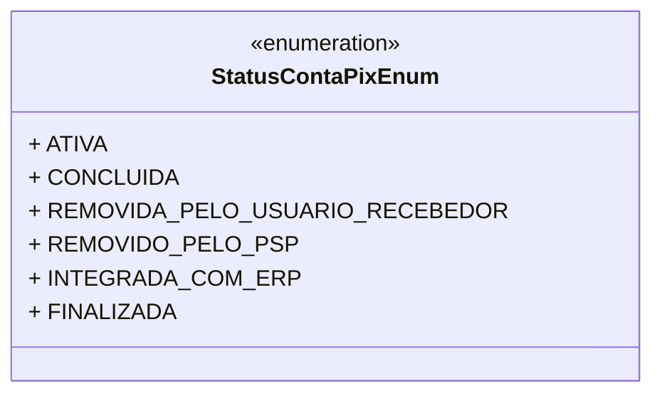

# StatusContaPixEnum
**Namespace**: IsthmusWinthor.Dominio.Enumeradores  
**Nome do Arquivo**: StatusContaPixEnum.cs  

O `StatusContaPixEnum` é um enumerador que representa os diferentes estados de uma conta PIX dentro do sistema, funcionando como uma forma de categorizar o status do pagamento e integração do pedido ao ERP. Ele é crucial para a gestão financeira e de processos, garantindo que o fluxo de pagamento e conciliação esteja devidamente controlado.

## Tipos Auxiliares e Dependências
- **Enums**:
  - `[StatusContaPixEnum](StatusContaPixEnum.md)`

## Diagrama de Relacionamentos

