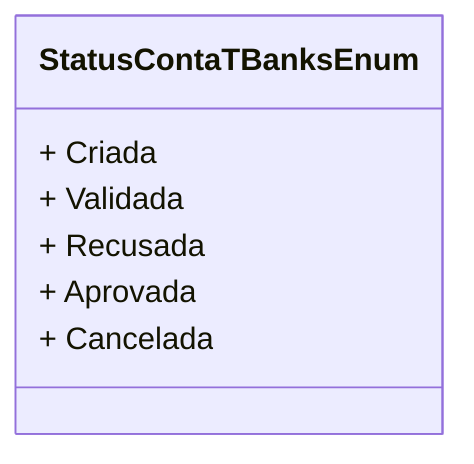

# StatusContaTBanksEnum
**Namespace**: IsthmusWinthor.Dominio.Enumeradores  
**Nome do Arquivo**: StatusContaTBanksEnum.cs  

Esta enumeração é utilizada para representar o status de uma conta em uma aplicação bancária, permitindo um controle e visualização claros das diferentes etapas no ciclo de vida de uma conta.

## Tipos Auxiliares e Dependências
- **Enumeradores**:
  - `[StatusContaTBanksEnum](StatusContaTBanksEnum.md)`

## Diagrama de Relacionamentos

