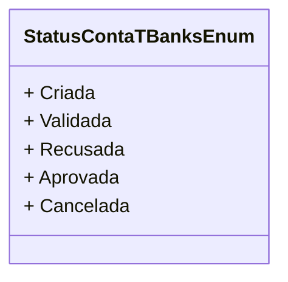

# StatusContaTBanksEnum
**Namespace**: IsthmusWinthor.Dominio.Enumeradores  
**Nome do Arquivo**: StatusContaTBanksEnum.cs  

O `StatusContaTBanksEnum` é um enumerador que define os diferentes estados possíveis de uma conta no sistema. Ele é utilizado para gerenciar o ciclo de vida das contas, possibilitando a identificação clara de em que fase cada conta se encontra, facilitando assim a tomada de decisão e o controle de fluxos operacionais.

## Tipos Auxiliares e Dependências
- **Enumeradores**:
  - [StatusContaTBanksEnum](StatusContaTBanksEnum.md)

## Diagrama de Relacionamentos

---
Gerada em 29/12/2025 21:01:02
