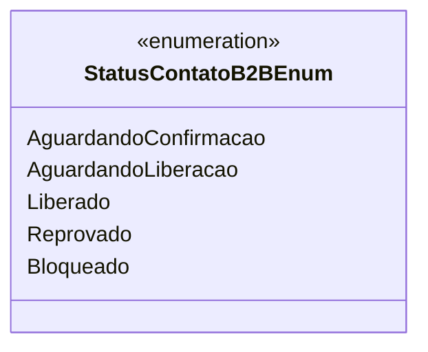

# StatusContatoB2BEnum
- **Namespace**: IsthmusWinthor.Dominio.Enumeradores
- **Nome do Arquivo**: StatusContatoB2BEnum.cs

O `StatusContatoB2BEnum` é um enumerador que representa os diferentes estados de um contato B2B dentro do sistema, com o objetivo de manter a integridade dos dados relacionados ao status de cadastro dos usuários no sistema.

## Tipos Auxiliares e Dependências
- Enumeradores:
  - `[StatusContatoB2BEnum](StatusContatoB2BEnum.md)`

## Diagrama de Relacionamentos

