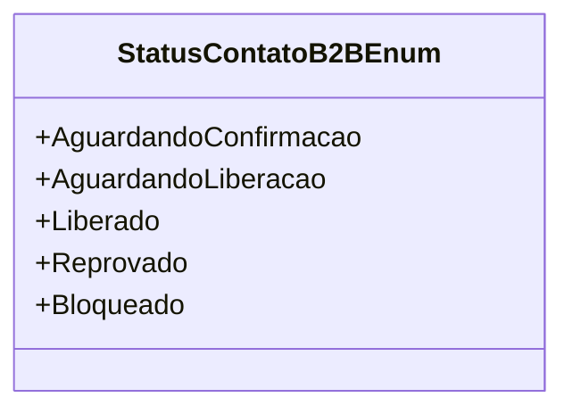

# StatusContatoB2BEnum

**Namespace**: IsthmusWinthor.Dominio.Enumeradores  
**Nome do Arquivo**: StatusContatoB2BEnum.cs  

### Visão Geral e Responsabilidade
O `StatusContatoB2BEnum` é um enumerador que define os diferentes estados que um contato B2B (Business to Business) pode assumir durante o processo de registro e validação. Este enumerador é crucial para o gerenciamento do fluxo dos cadastros na aplicação, permitindo que os sistemas e os usuários compreendam rapidamente a situação atual de uma solicitação de contato.

### Métodos de Negócio
Este enumerador não contém métodos com lógica de negócio.

### Propriedades Calculadas e de Validação
Este enumerador não contém propriedades calculadas ou de validação.

### Navigations Property
Este enumerador não contém propriedades que sejam classes complexas do domínio.

### Tipos Auxiliares e Dependências
- Este enumerador não depende de classes ou enums adicionais.

### Diagrama de Relacionamentos

---
Gerada em 29/12/2025 21:01:08
