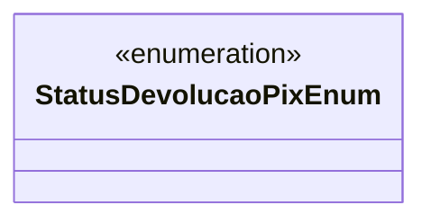

# StatusDevolucaoPixEnum
**Namespace**: IsthmusWinthor.Dominio.Enumeradores  
**Nome do Arquivo**: StatusDevolucaoPixEnum.cs  

O `StatusDevolucaoPixEnum` é um enumerador que representa os diferentes estados de uma devolução via PIX, facilitando a identificação e o gerenciamento do fluxo desse processo na aplicação.

## Métodos de Negócio
Não há métodos de negócio a serem documentados nesta classe, uma vez que se trata apenas de um enumerador.

## Propriedades Calculadas e de Validação
Este enumerador não possui propriedades calculadas ou de validação.

## Navigations Property
Este enumerador não possui propriedades de navegação, pois não está associado a outras classes do domínio.

## Tipos Auxiliares e Dependências
- Não há tipos auxiliares ou dependências que esta classe utilize, além de suas próprias definições de status.

## Diagrama de Relacionamentos

