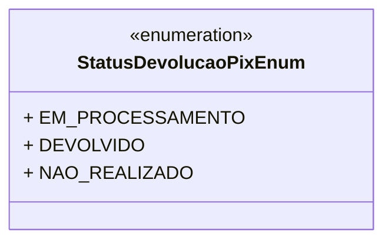

# StatusDevolucaoPixEnum
**Namespace**: IsthmusWinthor.Dominio.Enumeradores  
**Nome do Arquivo**: StatusDevolucaoPixEnum.cs  

> Enum que representa os diferentes estados de uma devolução via PIX.

## Tipos Auxiliares e Dependências
- **Enumeradores**:
  - [StatusDevolucaoPixEnum](StatusDevolucaoPixEnum.md)

## Diagrama de Relacionamentos

---
Gerada em 29/12/2025 21:01:12
