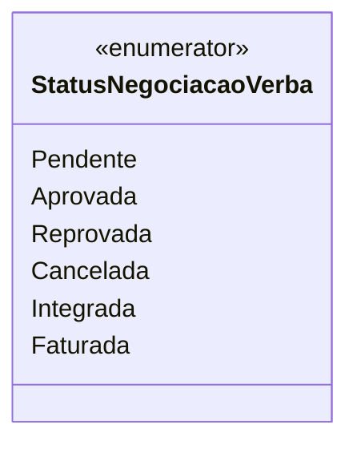

# StatusNegociacaoVerba
- **Namespace**: IsthmusWinthor.Dominio.Enumeradores
- **Nome do Arquivo**: StatusNegociacaoVerba.cs

## Visão Geral e Responsabilidade
A enumeração `StatusNegociacaoVerba` define os diferentes estados possíveis para uma negociação de verba dentro do sistema. Esta enumeração é essencial para garantir que as negociações sejam processadas corretamente de acordo com seu estado atual, ajudando na validação do fluxo de negócios e na tomada de decisões.

## Propriedades Calculadas e de Validação
- Não existem propriedades calculadas ou de validação nesta enumeração, já que sua função principal é a definição de constantes que representam estados distintos.

## Navigations Property
- Nenhuma Navigation Property está presente nesta classe, pois trata-se de uma enumeração e não de uma classe de domínio complexa.

## Tipos Auxiliares e Dependências
- Não há tipos auxiliares ou dependências adicionais

## Diagrama de Relacionamentos

