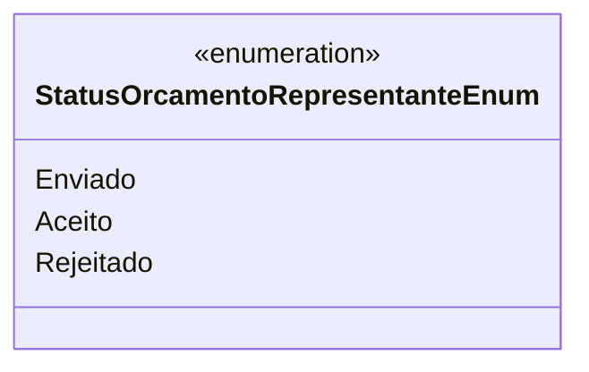

# StatusOrcamentoRepresentanteEnum
- **Namespace**: IsthmusWinthor.Dominio.Enumeradores
- **Nome do Arquivo**: StatusOrcamentoRepresentanteEnum.cs

Este é um enumerador que representa os diferentes estados que um orçamento pode assumir em relação a um representante. Ele é utilizado para gerenciar o fluxo de aprovação e os estados do orçamento dentro do sistema.

## Tipos Auxiliares e Dependências
- **Enumeradores:**
  - [StatusOrcamentoRepresentanteEnum](StatusOrcamentoRepresentanteEnum.md): Enum que contém os status de um orçamento.

## Diagrama de Relacionamentos

---
Gerada em 29/12/2025 21:01:20
