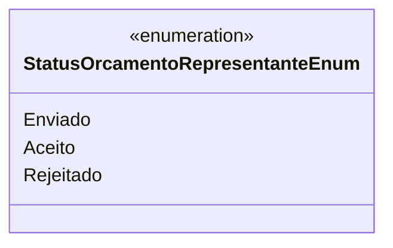

# StatusOrcamentoRepresentanteEnum
**Namespace**: IsthmusWinthor.Dominio.Enumeradores  
**Nome do Arquivo**: StatusOrcamentoRepresentanteEnum.cs  

Este enumerador é utilizado para definir os diferentes status que um orçamento pode ter em relação ao representante no sistema.

## Tipos Auxiliares e Dependências
- Nenhum.

## Diagrama de Relacionamentos

