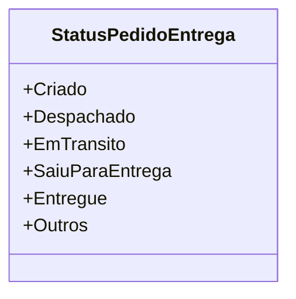

# StatusPedidoEntrega
- **Namespace**: IsthmusWinthor.Dominio.Enumeradores
- **Nome do Arquivo**: StatusPedidoEntrega.cs

O `StatusPedidoEntrega` é um enumerador que define os diversos estados que um pedido de entrega pode assumir durante seu ciclo de vida. Este modelo ajuda a gerenciar e identificar o status de entrega de um pedido, tornando clara a situação atual para os sistemas e usuários envolvidos.

## Tipos Auxiliares e Dependências
- Nenhum tipo auxiliar ou dependência adicional a ser mencionado.

## Diagrama de Relacionamentos

