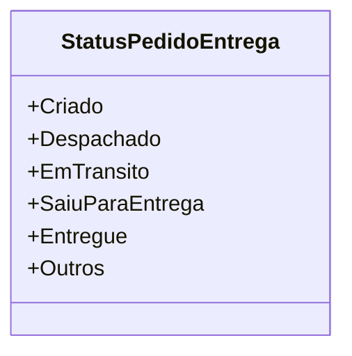

# StatusPedidoEntrega
**Namespace**: IsthmusWinthor.Dominio.Enumeradores  
**Nome do Arquivo**: StatusPedidoEntrega.cs

O `StatusPedidoEntrega` é um enumerador que define os diferentes estados que um pedido de entrega pode assumir durante seu ciclo de vida. A correta utilização deste enum possibilita a padronização do gerenciamento do status dos pedidos, garantindo que a aplicação tenha um controle claro sobre a fase em que cada pedido se encontra.

## Tipos Auxiliares e Dependências
- Nenhum tipo auxiliar ou dependência adicional.

## Diagrama de Relacionamentos

---
Gerada em 29/12/2025 21:01:24
