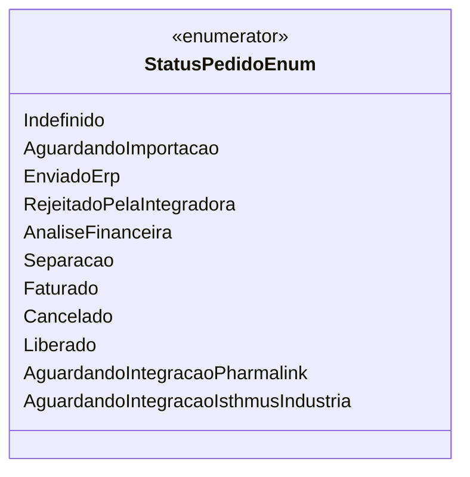

# StatusPedidoEnum
**Namespace**: IsthmusWinthor.Dominio.Enumeradores  
**Nome do Arquivo**: StatusPedidoEnum.cs  

O `StatusPedidoEnum` é um enumerador que representa os diferentes estados pelos quais um pedido pode passar no sistema. Ele é crucial para o gerenciamento do ciclo de vida do pedido e garante que o sistema mantenha a integridade dos processos de inserção, análise, faturamento e cancelamento de pedidos.

## Tipos Auxiliares e Dependências
- Enumerador: 
  - [StatusPedidoEnum](StatusPedidoEnum.md)

## Diagrama de Relacionamentos

---
Gerada em 29/12/2025 21:01:29
