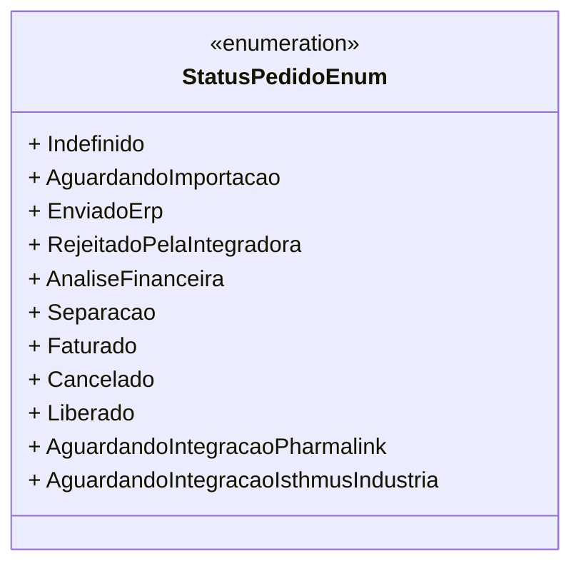

# StatusPedidoEnum
**Namespace**: IsthmusWinthor.Dominio.Enumeradores  
**Nome do Arquivo**: StatusPedidoEnum.cs  

Este enumerador representa os diferentes estados que um pedido pode ter no sistema. Ele é utilizado para descrever o status de um pedido durante todo o seu ciclo de vida, permitindo que o sistema e os usuários acompanhem as etapas do processo de venda e entrega.

## Tipos Auxiliares e Dependências
- **Enumeradores**:
  - `[StatusPedidoEnum](StatusPedidoEnum.md)`

## Diagrama de Relacionamentos

