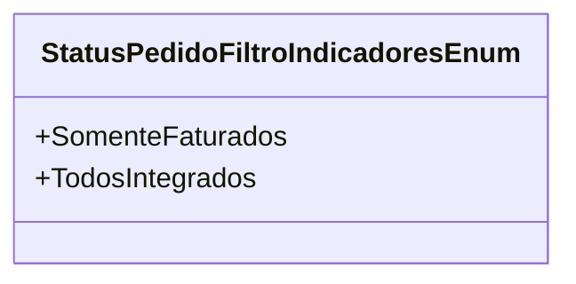

# StatusPedidoFiltroIndicadoresEnum
**Namespace**: IsthmusWinthor.Dominio.Enumeradores  
**Nome do Arquivo**: StatusPedidoFiltroIndicadoresEnum.cs  

Este enum é utilizado para definir os tipos de filtros que podem ser aplicados a pedidos no sistema, ajudando na categorização e análise de dados relacionados a pedidos de forma consistente.

### Tipos Auxiliares e Dependências
- Enumeradores:
  - [StatusPedidoFiltroIndicadoresEnum](StatusPedidoFiltroIndicadoresEnum.md)

### Diagrama de Relacionamentos

Este diagrama representa as opções disponíveis no enumerador `StatusPedidoFiltroIndicadoresEnum`, permitindo uma visualização clara das opções que estão disponíveis ao usuário para filtrar pedidos.
---
Gerada em 29/12/2025 21:01:34
