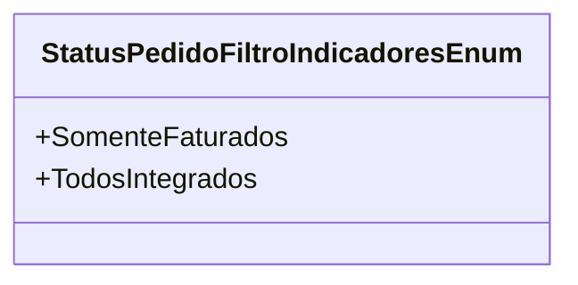

# StatusPedidoFiltroIndicadoresEnum

**Namespace**: IsthmusWinthor.Dominio.Enumeradores  
**Nome do Arquivo**: StatusPedidoFiltroIndicadoresEnum.cs  

> Esta classe enum é responsável por definir os diferentes status de filtragem de pedidos utilizados no sistema, facilitando a categorização e visualização dos pedidos em diferentes estágios.

## Tipos Auxiliares e Dependências
- **Enumeradores**:
  - `StatusPedidoFiltroIndicadoresEnum`

## Diagrama de Relacionamentos

Este documento descreve o `StatusPedidoFiltroIndicadoresEnum`, utilizado para segmentar pedidos dentro da aplicação, possibilitando uma melhor gestão e análise dos dados nos relatórios.
