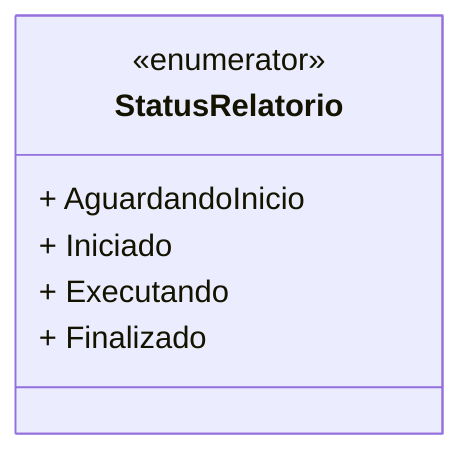

# StatusRelatorio
**Namespace**: IsthmusWinthor.Dominio.Enumeradores  
**Nome do Arquivo**: StatusRelatorio.cs  

Este enumerador define os diferentes estados que um relatório pode assumir ao longo de seu ciclo de vida, permitindo um controle mais eficaz sobre o fluxo de processamento dos relatórios no sistema.

## Tipos Auxiliares e Dependências
- Nenhum.

## Diagrama de Relacionamentos

