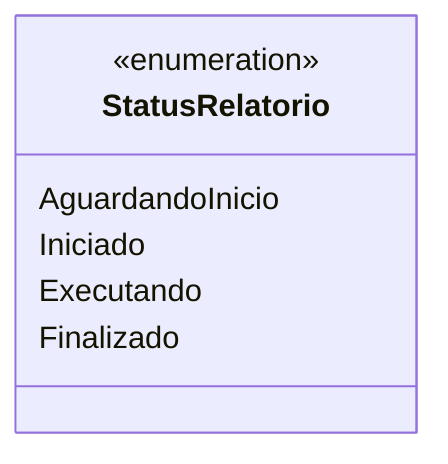

# StatusRelatorio

**Namespace**: IsthmusWinthor.Dominio.Enumeradores  
**Nome do Arquivo**: StatusRelatorio.cs  

## Visão Geral
O `StatusRelatorio` é um enumerador que define os diferentes estados possíveis de um relatório em um sistema de processamento de dados. Ele permite que outras partes do sistema identifiquem e tratem adequadamente os diferentes estágios da execução dos relatórios, garantindo uma melhor gestão e acompanhamento do fluxo de trabalho.

## Tipos Auxiliares e Dependências
- **Enumerador**:
  - [StatusRelatorio](StatusRelatorio.md)

## Diagrama de Relacionamentos

A documentação fornecida resume a lógica e o propósito do enumerador `StatusRelatorio`, destacando sua utilidade dentro do contexto do sistema. É fundamental a utilização adequadamente de seus estados para garantir a integridade no fluxo dos relatórios processados.
---
Gerada em 29/12/2025 21:01:40
