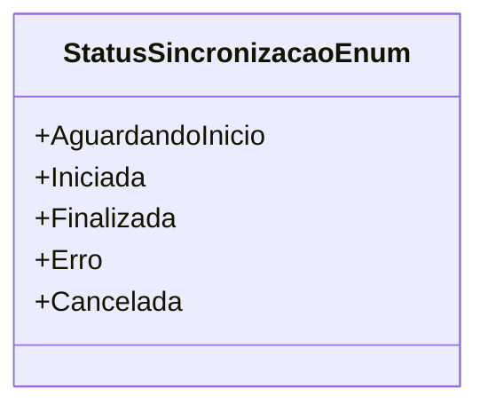

# StatusSincronizacaoEnum
**Namespace**: IsthmusWinthor.Dominio.Enumeradores  
**Nome do Arquivo**: StatusSincronizacaoEnum.cs  

Este enumerador é utilizado para categorizar o estado de um processo de sincronização em um sistema, definindo os possíveis status que um processo pode ter ao longo de seu ciclo de vida.

## Tipos Auxiliares e Dependências
- Enumeradores:
  - `[StatusSincronizacaoEnum](StatusSincronizacaoEnum.md)`

## Diagrama de Relacionamentos

