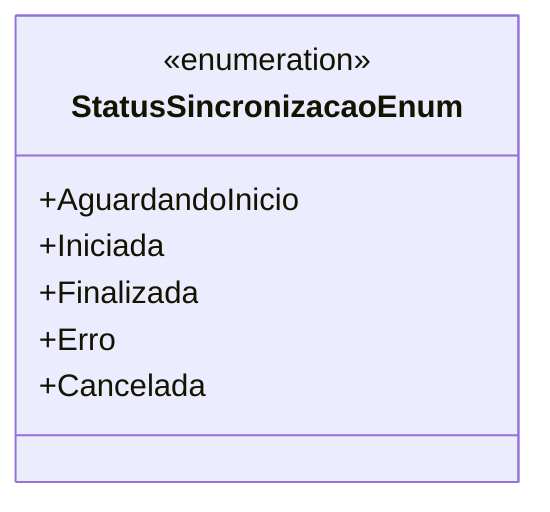

# StatusSincronizacaoEnum
**Namespace**: IsthmusWinthor.Dominio.Enumeradores  
**Nome do Arquivo**: StatusSincronizacaoEnum.cs

## Visão Geral e Responsabilidade
O `StatusSincronizacaoEnum` é uma enumeração que representa os diferentes estados de sincronização em um sistema. Esta classe tem como objetivo oferecer uma lista clara e padronizada dos possíveis estados, permitindo que outras partes do sistema tratem esses estados de forma consistente e compreensível. Isso é fundamental para o monitoramento e controle de processos de sincronização, garantindo que o sistema possa responder corretamente a cada situação.

## Tipos Auxiliares e Dependências
- Nenhum.

## Diagrama de Relacionamentos

---
Gerada em 29/12/2025 21:01:46
